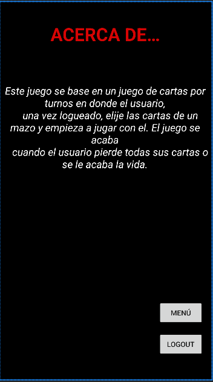

# Cómo lo hemos construido

Para empezar tuvimos que seguir las diferentes pantallas que necesitábamos implementar y componerlas con las cajas o contenedores pertinentes para ser lo más fieles a lo que nuestro cliente quiere.

A parte de satisfacer el cliente la aplicación está dispuesta para ser fiel a su operatividad principal y cumplir los requisitos propuestos.

Ahora veremos una breve explicación de las pantallas, en las cuáles tenemos las funciones de la aplicación.

* Log In&#x20;
* Registro
* Contraseña Olvidada
* Inicio
* Personajes
* Jugar

A cada una de las pantallas se le ha dado la posibilidad de ir a la anterior y en el pantallas de juego cuando nuestro usuario no le interese jugar más podrá hacer una desconexión de su cuenta gracias al botón de Log Out.

Antes de empezar a desarrollar las distintas actividades, hemos partido de un diseño básico desarrollado en Figma, como el que hemos visto precedentemente.&#x20;

## ACTIVITIES

### main\_activity

Esta activity representa la activity principal en donde el usuario puede loguearse, modificar contraseña y crear un nuevo usuario. Todas esas acciones llevan a su correspondiente activity. Esta activity está asociada a una clase Java que se llama MainActivity en donde explicamos la lógica.

```java
public class MainActivity extends AppCompatActivity {
    private EditText email;
    private EditText password;
    private Button entry_button;
    private Button register_button;
    private Button password_button;
    private Intent intent;
    private DBHelper DB;

    @Override
    protected void onCreate(Bundle savedInstanceState) {
        super.onCreate(savedInstanceState);
        setContentView(R.layout.activity_main);

        DB = new DBHelper(this);
        email = (EditText) findViewById(R.id.email);
        password = (EditText) findViewById(R.id.password);

        register_button = (Button) findViewById(R.id.registro);
        register_button.setOnClickListener(new View.OnClickListener() {
            @Override
            public void onClick(View v) {
                intent = new Intent(MainActivity.this, Registration.class);
                startActivity(intent);
            }
        });

        password_button = (Button) findViewById(R.id.contr);
        password_button.setOnClickListener(new View.OnClickListener() {
            @Override
            public void onClick(View v) {
                intent = new Intent(MainActivity.this, Password.class);
                startActivity(intent);
            }
        });

        entry_button = (Button) findViewById(R.id.button);
        entry_button.setOnClickListener(new View.OnClickListener() {
            @Override
            public void onClick(View view) {

                String mail = email.getText().toString();
                String pass = password.getText().toString();

                if (email.equals("") || pass.equals(""))
                    Toast.makeText(MainActivity.this, "Please enter all the fields", Toast.LENGTH_SHORT).show();
                else {
                    Boolean checkuserpass = DB.checkMailPassword(mail, pass);
                    if (checkuserpass == true) {
                        Toast.makeText(MainActivity.this, "Sign in successfull", Toast.LENGTH_SHORT).show();
                        Intent intent = new Intent(getApplicationContext(), Menu.class);
                        startActivity(intent);
                    } else {
                        Toast.makeText(MainActivity.this, "Invalid Credentials", Toast.LENGTH_SHORT).show();
                    }
                }
            }
        });


    }
}
```

Esta es la aparencia de la actividad principal:

<figure><figcaption><p>activity_main.xml</p></figcaption></figure>

### activity\_registration

Esta actividad representa la creación de una nueva cuenta de usuario, utilizando una base en local (DBHelper, SQLiteDatabase). Esta activity está asociada a una clase Java llamada Registration.&#x20;

```java
public class Registration extends AppCompatActivity {

    EditText email, password, repassword;
    Button registrar;
    DBHelper DB;
    @Override
    protected void onCreate(Bundle savedInstanceState) {
        super.onCreate(savedInstanceState);
        setContentView(R.layout.activity_registration);

        email = (EditText) findViewById(R.id.email);
        password = (EditText) findViewById(R.id.password);
        repassword = (EditText) findViewById(R.id.repassword);
        registrar = (Button) findViewById(R.id.registrar);
        DB = new DBHelper(this);

        registrar.setOnClickListener(new View.OnClickListener() {
            @Override
            public void onClick(View view) {
                String user = email.getText().toString();
                String pass = password.getText().toString();
                String repass = repassword.getText().toString();

                if(user.equals("")||pass.equals("")||repass.equals(""))
                    Toast.makeText(Registration.this, "Please enter all the fields", Toast.LENGTH_SHORT).show();
                else{
                    if(pass.equals(repass)){
                        Boolean checkuser = DB.checkEmail(user);
                        if(checkuser==false){
                            Boolean insert = DB.insertData(user, pass);
                            if(insert==true){
                                Toast.makeText(Registration.this, "Registered successfully", Toast.LENGTH_SHORT).show();
                                Intent intent = new Intent(getApplicationContext(),MainActivity.class);
                                startActivity(intent);
                            }else{
                                Toast.makeText(Registration.this, "Registration failed", Toast.LENGTH_SHORT).show();
                            }
                        }
                        else{
                            Toast.makeText(Registration.this, "User already exists! please sign in", Toast.LENGTH_SHORT).show();
                        }
                    }else{
                        Toast.makeText(Registration.this, "Passwords not matching", Toast.LENGTH_SHORT).show();
                    }
                } }
        });
    }
}


```

Esta es la aparencia de la actividad:

<figure><figcaption><p>activity_registration.xml</p></figcaption></figure>

Tanto como el login, registro de usuario y el cambio de contraseña hemos utilizado una base de datos. Aquí ponemos los metodos mas importantes para el desarrollo de la aplicación.

```java
@Override
    public void onCreate(SQLiteDatabase MyDB) {
        MyDB.execSQL("create Table users(email TEXT primary key, password TEXT)");
    }

    @Override
    public void onUpgrade(SQLiteDatabase MyDB, int i, int i1) {
        MyDB.execSQL("drop Table if exists users");
    }

    public Boolean insertData(String email, String password){
        SQLiteDatabase MyDB = this.getWritableDatabase();
        ContentValues contentValues= new ContentValues();
        contentValues.put("email", email);
        contentValues.put("password", password);
        long result = MyDB.insert("users", null, contentValues);
        if(result==-1) return false;
        else
            return true;
    }

    public Boolean checkEmail(String email) {
        SQLiteDatabase MyDB = this.getWritableDatabase();
        Cursor cursor = MyDB.rawQuery("Select * from users where email = ?", new String[]{email});
        if (cursor.getCount() > 0)
            return true;
        else
            return false;
    }

    public Boolean checkMailPassword(String email, String password){
        SQLiteDatabase MyDB = this.getWritableDatabase();
        Cursor cursor = MyDB.rawQuery("Select * from users where email = ? and password = ?", new String[] {email,password});
        if(cursor.getCount()>0)
            return true;
        else
            return false;
    }

    public Boolean updatepassword(String mail, String password) {
        SQLiteDatabase MyDB = this.getWritableDatabase();
        ContentValues contentValues = new ContentValues();
        contentValues.put("password", password);
        long result = MyDB.update("users",  contentValues, "email = ?", new String[] {mail});
        if(result==-1) return false;
        else
            return true;
    }
}
```

### reset\_activity y forgot\_password\_activity

Estas dos actividades representan el cambio de contraseña que puede hacer el usuario en caso de que se ha olvidado su contraseña. Estas dos actividades estan asociadas a dos clases Java ResetActivity y Password

```java
// Reset Activity class
public class ResetActivity extends AppCompatActivity {
    TextView email;
    EditText pass, repass;
    Button confirm;
    DBHelper DB;

    @Override
    protected void onCreate(Bundle savedInstanceState) {
        super.onCreate(savedInstanceState);
        setContentView(R.layout.activity_reset);

        email = (TextView) findViewById(R.id.email_extra);
        pass = (EditText) findViewById(R.id.new_password);
        repass = (EditText) findViewById(R.id.new_repassword);
        confirm = (Button) findViewById(R.id.confirmar);
        DB  = new DBHelper(this);

        Intent intent = getIntent();
        email.setText(intent.getStringExtra("email"));

        confirm.setOnClickListener(new View.OnClickListener() {
            @Override
            public void onClick(View v) {

                String mail = email.getText().toString();
                String password = pass.getText().toString();
                String repassword = repass.getText().toString();

                if(password.equals(repassword)) {
                    Boolean checkPassUpdate = DB.updatepassword(mail, password);
                    if (checkPassUpdate) {
                       Intent intent = new Intent(ResetActivity.this, MainActivity.class);
                        startActivity(intent);
                        Toast.makeText(ResetActivity.this, "Password uptated successfully", Toast.LENGTH_SHORT).show();
                    } else {
                        Toast.makeText(ResetActivity.this, "Password not updated", Toast.LENGTH_SHORT).show();
                    }
                }else{
                    Toast.makeText(ResetActivity.this, "Password not matching", Toast.LENGTH_SHORT).show();
                }
            }
        });

    }
}

```

```java
// Password class
public class Password  extends AppCompatActivity {

   private EditText email;
   private Button reset;
   private DBHelper DB;
   Intent intent;

    @Override
    protected void onCreate(Bundle savedInstanceState) {
        super.onCreate(savedInstanceState);
        setContentView(R.layout.activity_forgot_password);

        email = (EditText) findViewById(R.id.mail_reset);
        reset = (Button) findViewById(R.id.reset);
        DB = new DBHelper(this);

        reset.setOnClickListener(new View.OnClickListener() {
            @Override
            public void onClick(View v) {
                String mail = email.getText().toString();
                Boolean checkuser = DB.checkEmail(mail);

                if(checkuser){
                    intent = new Intent(Password.this, ResetActivity.class);
                    intent.putExtra("email",mail);
                    startActivity(intent);
                }else{
                    Toast.makeText(Password.this, "Mail does not exists", Toast.LENGTH_SHORT).show();
                }
            }
        });


    }
}

```

Esta es la aparencia de las dos clases:

<figure><figcaption><p>activity_forgot_password.xml</p></figcaption></figure>

<figure><figcaption><p>activity_reset.xml</p></figcaption></figure>

Una vez logueado al usuario le aparecera un menú en donde tendrá 4 opciones que nosotros hemos desplegado con botones: las opciones que tiene el usuario son las siguientes:&#x20;

* Sobre el Juego: en donde el usuario puede leer una breve descripción de lo que es el juego
* Jugar: en donde el usuario puede jugar al juego (opcion que se implementará en un segundo momento)
* Personajes: en donde el usuario puede ver los personajes disponibles del juego
* Cerrar sesión: para volver a la página de inicio.

Esta es la aparencia del menu.

<figure><figcaption><p>activity_menu.xml</p></figcaption></figure>

A continuacíon vamos a mostrar las aparencias de las otras actividades que implementa el menu:

<figure><figcaption><p>activity_presentation.xml</p></figcaption></figure>

<figure><figcaption><p>activity_characters.xml</p></figcaption></figure>

Después de la implementación de esas actividades con sus respectivas clases en Java hemos añadido soporte para el idioma inglés. Esto significa que la aplicación se puede usar tanto en inglés como en español. El idioma depende del idioma del móvil por defecto.&#x20;

Para que toda la aplicación compile hemos tenido que modificar el AndroidManifest. A continuación veremos su aparencia.

```xml
<?xml version="1.0" encoding="utf-8"?>
<manifest xmlns:android="http://schemas.android.com/apk/res/android"
    xmlns:tools="http://schemas.android.com/tools">

    <application
        android:allowBackup="true"
        android:dataExtractionRules="@xml/data_extraction_rules"
        android:fullBackupContent="@xml/backup_rules"
        android:icon="@mipmap/ic_launcher"
        android:label="@string/app_name"
        android:roundIcon="@mipmap/ic_launcher_round"
        android:supportsRtl="true"
        android:theme="@style/Theme.UAX_ARENA"
        tools:targetApi="31">
        <activity
            android:name=".MainActivity"
            android:exported="true">
            <intent-filter>
                <action android:name="android.intent.action.MAIN" />

                <category android:name="android.intent.category.LAUNCHER" />
            </intent-filter>

            <meta-data
                android:name="android.app.lib_name"
                android:value="" />
        </activity>
        <activity
            android:name=".Menu"
            android:exported="false">
            <meta-data
                android:name="android.app.lib_name"
                android:value="" />
        </activity>
        <activity
            android:name=".Characters"
            android:exported="false">
            <meta-data
                android:name="android.app.lib_name"
                android:value="" />
        </activity>
        <activity
            android:name=".Presentation"
            android:exported="false">
            <meta-data
                android:name="android.app.lib_name"
                android:value="" />
        </activity>
        <activity
            android:name=".Registration"
            android:exported="false">
            <meta-data
                android:name="android.app.lib_name"
                android:value="" />
        </activity>
        <activity
            android:name=".Password"
            android:exported="false">
            <meta-data
                android:name="android.app.lib_name"
                android:value="" />
        </activity>
        <activity
            android:name=".Juego"
            android:exported="false">
            <meta-data
                android:name="android.app.lib_name"
                android:value="" />
        </activity>
        <activity
            android:name=".ResetActivity"
            android:exported="false">
            <meta-data
                android:name="android.app.lib_name"
                android:value="" />
        </activity>
    </application>

</manifest>
```
